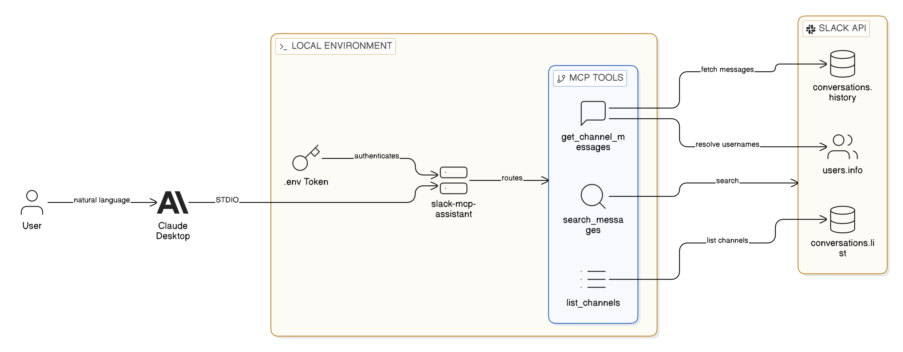

# Slack MCP Assistant

An MCP server that connects Claude Desktop directly to Slack, enabling natural language queries against workspace messages for instant summarisation and analysis.

## Overview

Teams drown in Slack messages. Important decisions get buried, context gets lost across channels, and catching up after time away means endless scrolling. This project solves that by letting Claude read and summarise Slack conversations on demand.

The implementation uses Anthropic's Model Context Protocol (MCP) to expose Slack's Web API as tools that Claude can invoke. When a user asks Claude "What happened in #engineering this week?", the MCP server fetches the relevant messages, and Claude synthesises a coherent summary. The architecture runs locally via stdio transport, keeping Slack credentials secure on the user's machine rather than routing through external services.

This demonstrates practical AI integration — not building another chatbot, but extending an existing AI assistant with real-time access to organisational data. The MCP pattern is how AI tools will increasingly connect to enterprise systems.

## Architecture

Claude Desktop communicates with the MCP server over stdio, using JSON-RPC to invoke tools. The server translates these tool calls into Slack Web API requests, handles OAuth token authentication, and returns structured message data for Claude to process.

The flow works as follows: user asks Claude a question about Slack → Claude determines which MCP tool to call → server authenticates with Slack using bot token → fetches channel messages with optional time filtering → returns formatted JSON → Claude generates natural language response.

User mapping enriches raw message data — the server resolves Slack user IDs to real names, making Claude's summaries more readable than the underlying API responses.

## Tech Stack

**Runtime**: Node.js 18+, ES Modules  
**Protocol**: Model Context Protocol SDK (stdio transport)  
**Integration**: Slack Web API, OAuth 2.0 Bot Tokens  
**AI**: Claude Desktop (client)

## Key Decisions

- **Stdio over HTTP transport**: Running locally via stdio eliminates network complexity and keeps Slack tokens off any server. For a single-user tool, this is simpler and more secure than hosting an HTTP endpoint.

- **Channel name resolution**: The API accepts both channel names and IDs, automatically looking up IDs when names are provided. This makes the tool more natural to use — users think in channel names, not Slack's internal identifiers.

- **User ID enrichment**: Rather than returning raw user IDs, the server batch-fetches user profiles and maps them to real names. This adds latency but makes Claude's output immediately useful without post-processing.

- **Time-based filtering**: The `since` parameter enables queries like "messages from the last week" rather than dumping entire channel histories. This respects API rate limits and keeps Claude's context focused.

## Screenshots

## Author

**Noah Frost**

- Website: [noahfrost.co.uk](https://noahfrost.co.uk)
- GitHub: [github.com/nfroze](https://github.com/nfroze)
- LinkedIn: [linkedin.com/in/nfroze](https://linkedin.com/in/nfroze)