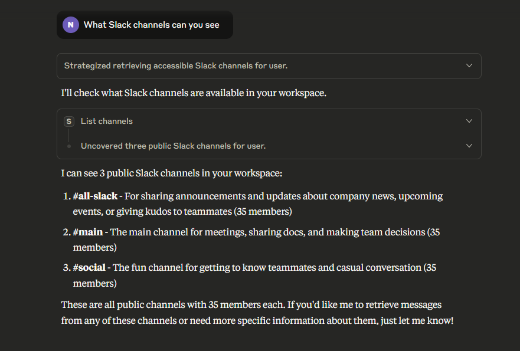
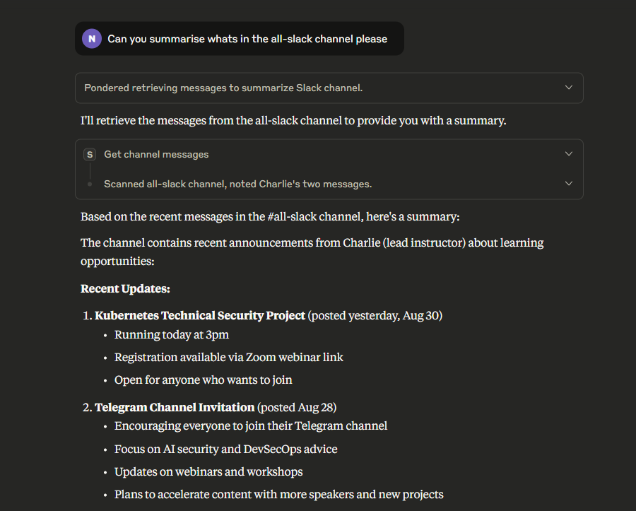

# Project 8: Slack MCP Assistant

Model Context Protocol server connecting Claude Desktop to Slack. Retrieves and summarises workspace messages using Slack Web API.

## Technologies

Node.js • Model Context Protocol • Slack Web API • Claude Desktop • OAuth 2.0

## Screenshots

